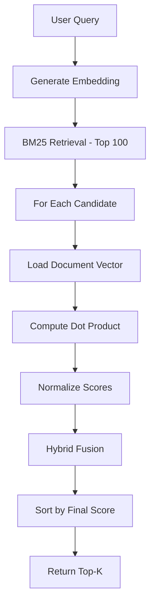

## Overview

Turbo Query implements a two-stage hybrid ranking pipeline that combines:

1. **BM25 candidate retrieval** - Fast keyword-based filtering
2. **Semantic reranking** - Dense vector similarity scoring
3. **Score fusion** - Weighted combination of both signals

This approach balances keyword precision with semantic understanding.

## Hybrid Scoring Formula

The final score combines normalized BM25 and cosine similarity:

```
final_score = 0.7 × BM25_norm + 0.3 × cosine_norm
```

<Info>
  The 70/30 weighting favors keyword relevance while incorporating semantic similarity.
</Info>

## Search Pipeline Implementation

The complete search handler implements the hybrid pipeline:

```go internal/shardnode/routes.go
const (
	rerankWindow = 100 // BM25 candidates to rerank
)

func (s *Server) handleSearch(w http.ResponseWriter, r *http.Request) {
	var req SearchRequest
	json.NewDecoder(r.Body).Decode(&req)

	if req.TopK <= 0 {
		req.TopK = 10
	}

	// Step 1: Generate query embedding
	qvec := embed.Embed(req.Query)
	if len(qvec) == 0 {
		http.Error(w, "embedding failed", http.StatusInternalServerError)
		return
	}

	// Step 2: BM25 retrieval
	query := bleve.NewMatchQuery(req.Query)
	searchReq := bleve.NewSearchRequestOptions(query, rerankWindow, 0, false)
	searchReq.Fields = []string{"title", "text"}
	res, err := s.index.Search(searchReq)
	// ...
```

## Stage 1: BM25 Candidate Retrieval

Bleve executes a keyword search to retrieve the top 100 candidates:

```go internal/shardnode/routes.go
query := bleve.NewMatchQuery(req.Query)
searchReq := bleve.NewSearchRequestOptions(query, rerankWindow, 0, false)
searchReq.Fields = []string{"title", "text"}
res, err := s.index.Search(searchReq)
```

### BM25 Retrieval Parameters

- **Query type**: `MatchQuery` - Standard text matching
- **Candidate window**: 100 documents (configurable via `rerankWindow`)
- **Fields retrieved**: `title`, `text` for result display

<Note>
  Retrieving 100 candidates creates a larger rerank pool while maintaining efficiency.
</Note>

## Stage 2: Score Normalization

BM25 scores are normalized using the maximum score:

```go internal/shardnode/routes.go
maxBM25 := res.Hits[0].Score
if maxBM25 == 0 {
	maxBM25 = 1
}
```

Each document's BM25 score is then divided by `maxBM25` to produce `BM25_norm ∈ [0, 1]`.

<Warning>
  Zero max score defaults to 1 to prevent division by zero.
</Warning>

## Stage 3: Vector Reranking

For each BM25 candidate, compute semantic similarity:

```go internal/shardnode/routes.go
for _, hit := range res.Hits {
	docID64, _ := strconv.ParseUint(hit.ID, 10, 32)
	docID := uint32(docID64)

	// Retrieve document vector from mmap
	dvec := s.getVector(docID)
	if len(dvec) == 0 {
		continue
	}

	// Compute cosine similarity (dot product on normalized vectors)
	cos := dot(qvec, dvec)
	normCos := (cos + 1) / 2  // Map [-1, 1] → [0, 1]

	// Normalize BM25 score
	normBM25 := hit.Score / maxBM25

	// Hybrid fusion
	final := 0.7*normBM25 + 0.3*normCos
	// ...
}
```

### Cosine Normalization

Cosine similarity produces values in `[-1, 1]`. The formula `(cos + 1) / 2` maps this to `[0, 1]`:

- `cos = 1` (identical) → `normCos = 1`
- `cos = 0` (orthogonal) → `normCos = 0.5`
- `cos = -1` (opposite) → `normCos = 0`

## Dot Product for Cosine Similarity

Since vectors are L2-normalized, cosine similarity reduces to dot product:

```go internal/shardnode/routes.go
func dot(a, b []float32) float64 {
	var sum float64
	for i := 0; i < len(a); i++ {
		sum += float64(a[i] * b[i])
	}
	return sum
}
```

For normalized vectors:
- `dot(a, b) = cos(θ)` where θ is the angle between vectors
- Range: `[-1, 1]`
- Higher values = more similar

<Tip>
  L2 normalization allows cosine similarity to be computed as a simple dot product, avoiding expensive square roots.
</Tip>

## Result Construction

Each hybrid-scored result includes fields from Bleve:

```go internal/shardnode/routes.go
var title, text string

if v, ok := hit.Fields["title"].(string); ok {
	title = v
}
if v, ok := hit.Fields["text"].(string); ok {
	text = v
}

hits = append(hits, SearchHit{
	DocID:   hit.ID,
	Score:   final,
	ShardID: s.shardID,
	Title:   title,
	Text:    text,
})
```

## Final Ranking

Results are sorted by hybrid score and truncated to top-K:

```go internal/shardnode/routes.go
sort.Slice(hits, func(i, j int) bool {
	return hits[i].Score > hits[j].Score
})

if len(hits) > req.TopK {
	hits = hits[:req.TopK]
}

json.NewEncoder(w).Encode(SearchResponse{Hits: hits})
```

## Complete Pipeline Diagram



## Performance Characteristics

<AccordionGroup>
  <Accordion title="BM25 Retrieval">
    Fast inverted index lookup using Bleve. Typically &lt;5ms for 100 candidates.
  </Accordion>
  
  <Accordion title="Embedding Generation">
    Dominates query latency. Ollama call takes ~5-10ms depending on query length.
  </Accordion>
  
  <Accordion title="Vector Similarity">
    Dot product over 384 dimensions × 100 candidates ≈ 38,400 operations. Very fast (&lt;1ms).
  </Accordion>
  
  <Accordion title="Total Latency">
    Typical per-shard latency: 10-15ms end-to-end.
  </Accordion>
</AccordionGroup>

## Tuning Parameters

### Rerank Window Size

```go
const rerankWindow = 100
```

Larger windows improve recall but increase latency:
- **50**: Faster, lower recall
- **100**: Balanced (default)
- **200**: Higher recall, slower

### Hybrid Weights

```go
final := 0.7*normBM25 + 0.3*normCos
```

Adjust based on use case:
- **0.9/0.1**: Keyword-dominant (factual search)
- **0.7/0.3**: Balanced (default)
- **0.5/0.5**: Equal weighting
- **0.3/0.7**: Semantic-dominant (conceptual search)

<Info>
  These weights can be made query-time parameters for adaptive ranking.
</Info>

## Why Hybrid Search?

<CardGroup cols={2}>
  <Card title="BM25 Strengths" icon="magnifying-glass">
    Excels at exact keyword matches, rare terms, and factual queries
  </Card>
  
  <Card title="Semantic Strengths" icon="brain">
    Handles synonyms, paraphrasing, and conceptual similarity
  </Card>
  
  <Card title="Combined Benefits" icon="handshake">
    Hybrid approach captures both lexical and semantic relevance
  </Card>
  
  <Card title="Proven Approach" icon="trophy">
    Used by production systems (Elasticsearch, Pinecone Hybrid Search)
  </Card>
</CardGroup>

## Related Topics

<CardGroup cols={2}>
  <Card title="Vector Storage" icon="database" href="/architecture/vector-storage">
    How normalized vectors are stored and retrieved
  </Card>
  <Card title="Architecture Overview" icon="diagram-project" href="/architecture/overview">
    Complete system architecture
  </Card>
</CardGroup>